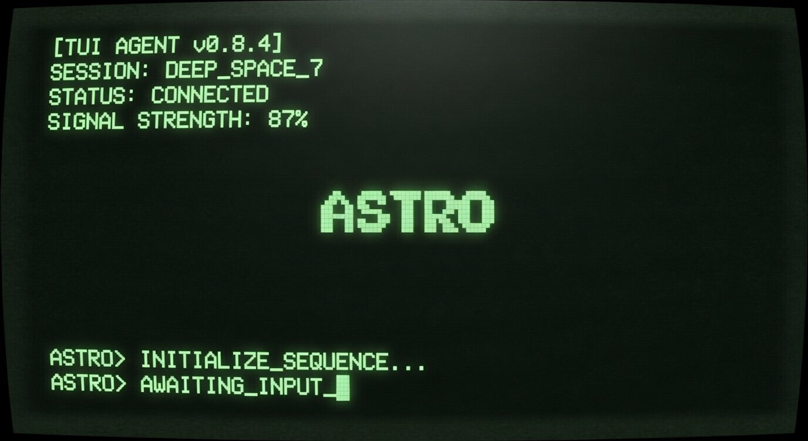

<div align="center">
  

  <h1>ASTRO V2.0 - Autonomous System Administrator</h1>
  <p><strong>A fully terminal-centric, open-source AI agent with a Matrix-themed TUI.</strong></p>
</div>

---

Astro is an open-source, fully terminal-centric AI agent. In V2.0, Astro has evolved from a simple text interface into a powerful, interactive LangGraph machine featuring a Textual-based dashboard (with a Matrix aesthetic) and ChromaDB persistent memory.

## 🚀 Key Upgrades (V1.0 ➜ V2.0)
- **Modular Architecture**: The project is cleanly structured into distinct modules (`core`, `ui`, `tools`, `agents`, `memory`).
- **Advanced U.I.**: Features a breathing orb and an interactive side-panel terminal built with Textual.
- **Secure Sudo**: Root passwords are symmetrically encrypted using Fernet AES-128 and safely stored locally in `.astro/`.
- **ChromaDB**: Conversation context is written to local storage, highly optimized for rapid CPU inference.
- **Zero-Permission Autonomy**: Astro seamlessly executes queries autonomously within its `bash_terminal` node without waiting for permissions. Sudo payloads are automatically decrypted and injected as needed.
- **VoIP Integration**: Live AI voice monitoring via Asterisk is dynamically printed alongside the main dashboard.

---

## 🛠️ Interactive Installation (New Feature)

The Astro setup process is now fully automated via an interactive CLI wizard that supports background animations and robust dependency management.

### Features of the CLI Wizard:
1. **Asterisk VoIP Prompt**: The wizard natively asks if you wish to install the Asterisk VoIP system, allowing Astro to perform outbound calls.
2. **Dynamic Extension Setup**: If Asterisk is selected, you can specify exactly how many SIP/PJSIP extensions to configure. You simply input the desired numbers (e.g., 101, 102, 103), and the system handles the rest.
3. **Automatic Configuration**: Your inputs are seamlessly written into Asterisk's `pjsip.conf` and `extensions.conf` with default robust passwords (`pass[number]`).
4. **CLI Animations**: Enjoy a clean and aesthetically pleasing CLI spinner animation while system packages update, virtual environments generate, and python dependencies install in the background.

### Getting Started

```bash
# Clone the repository (if you haven't already):
# git clone <repository_url>
# cd astro

# Launch the interactive installation script:
bash install.sh
```

Once the installation successfully completes, you will receive a confirmation message and Astro will be linked globally to `/usr/local/bin/astro`.

---

## 💻 Usage

To summon the Astro agent from any terminal, simply run:

```bash
astro run
```
